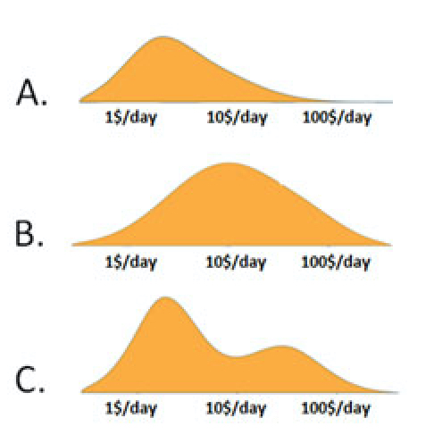

```{r startup, include = FALSE, message = FALSE, warning = FALSE}
knitr::opts_chunk$set(
  echo = F, 
  eval=T, 
  message=F, 
  warning=F, 
  error=F, 
  comment=NA, 
  cache=F)
rm(list=ls())
library(ggplot2)
library(plotly)
library(dplyr)
library(readr)
load("dati.Rdata")
```

# Scolarizzazione delle bambine nei Paesi a basso reddito

1. Attualmente, nei Paesi a basso reddito di tutto il mondo, quante bambine finiscono la scuola primaria? <br>
    $\Box$ A: 20 per cento <br>
    $\Box$ B: 40 per cento <br>
    $\Box$ C: 60 per cento 


```{r}
R1 <- dati %>%
      group_by(Q1) %>%
      summarise (n = n()) %>%
      mutate(perc = round(n *100/ sum(n),1))
p1 <- ggplot(data=R1, aes(x=Q1, y=perc, 
                          text=perc, 
                          fill=c("F","F","T"))) +
      geom_bar(stat="identity") +
      geom_hline(yintercept=33.33) +
      ylab("Percentuale") +
      xlab("Risposta") +
      guides(fill=FALSE) +
      theme_bw() +
      coord_flip() 
ggplotly(p1,
        tooltip="text")
```


# Distribuzione del reddito globale

2. Quali delle seguenti curve rappresenta la distribuzione del reddito globale oggi? 

```{r, echo=FALSE, fig.align = 'center', out.width = '40%', out.height = '40%'}

```


```{r}
R2 <- dati %>%
      group_by(Q2) %>%
      summarise (n = n()) %>%
      mutate(perc = round(n *100/ sum(n),1))
p2 <- ggplot(data=R2, aes(x=Q2, y=perc, 
                          text=perc, 
                          fill=c("F","T","F"))) +
      geom_bar(stat="identity") +
      geom_hline(yintercept=33.33) +
      ylab("Percentuale") +
      xlab("Risposta") +
      guides(fill=FALSE) +
      theme_bw() +
      coord_flip() 
ggplotly(p2,
        tooltip="text")
```

# Povertà estrema

3. Negli ultimi 20 anni, la percentuale della popolazione mondiale che vive in condizioni di estrema povertà è più o meno ... <br>
    $\Box$ A: Raddoppiata <br>
    $\Box$ B: Rimasta la stessa <br>
    $\Box$ C: Dimezzata
    
```{r}
R3 <- dati %>%
      group_by(Q3) %>%
      summarise (n = n()) %>%
      mutate(perc = round(n *100/ sum(n),1))
p3 <- ggplot(data=R3, aes(x=Q3, y=perc, 
                          text=perc, 
                          fill=c("T","F","F"))) +
      geom_bar(stat="identity") +
      geom_hline(yintercept=33.33) +
      ylab("Percentuale") +
      xlab("Risposta") +
      guides(fill=FALSE) +
      theme_bw() +
      coord_flip() 
ggplotly(p3,
        tooltip="text")
```

# Durata della vita

4. Qual è l’attuale aspettativa di vita a livello mondiale? <br>
    $\Box$ A: 50 anni <br>
    $\Box$ B: 60 anni <br>
    $\Box$ C: 70 anni
    
```{r}
R4 <- dati %>%
      group_by(Q4) %>%
      summarise (n = n()) %>%
      mutate(perc = round(n *100/ sum(n),1))
p4 <- ggplot(data=R4, aes(x=Q4, y=perc, 
                          text=perc, 
                          fill=c("F","F","T"))) +
      geom_bar(stat="identity") +
      geom_hline(yintercept=33.33) +
      ylab("Percentuale") +
      xlab("Risposta") +
      guides(fill=FALSE) +
      theme_bw() +
      coord_flip() 
ggplotly(p4,
        tooltip="text")
```

# Futuro numero di bambini

5. Oggi, sul pianeta, ci sono 2 miliardi di bambini tra 0 e 15 anni. Quanti ce ne saranno nel 2100, secondo le Nazioni Unite? <br>
    $\Box$ A: 4 miliardi <br>
    $\Box$ B: 3 miliardi <br>
    $\Box$ C: 2 miliardi
    
```{r}
R5 <- dati %>%
      group_by(Q5) %>%
      summarise (n = n()) %>%
      mutate(perc = round(n *100/ sum(n),1))
p5 <- ggplot(data=R5, aes(x=Q5, y=perc, 
                          text=perc, 
                          fill=c("T","F","F"))) +
      geom_bar(stat="identity") +
      geom_hline(yintercept=33.33) +
      ylab("Percentuale") +
      xlab("Risposta") +
      guides(fill=FALSE) +
      theme_bw() +
      coord_flip() 
ggplotly(p5,
        tooltip="text")
```

**Approfondimento di Luca**

La risposta modale è stata “3 miliardi”, mentre la risposta corretta era quella scelta di meno, cioè “2 miliardi”.

L’idea generale è che la popolazione mondiale sia in costante aumento, dunque è giustificabile pensare che anche il numero di bambini sia in crescita Per questo, partendo dal dato iniziale fornito dalla domanda (cioè che oggi i bambini tra 0 e 10 anni sono 2 miliardi), la risposta si è concentrata su valori più grandi di 2 miliardi.

```{r}

data1 <- read.csv("population_aged_0_4_years_total_number.csv")
data2 <- read.csv("population_aged_5_9_years_total_number.csv")
data3 <- read.csv("population_aged_10_14_years_total_number.csv")

data1[is.na(data1)] <- 0
data2[is.na(data1)] <- 0
data3[is.na(data1)] <- 0

a1 = colSums(data1[2:152])
b1 = colSums(data2[2:152])
c1 = colSums(data3[2:152])

somme = c(a1 + b1 + c1)

somme_nona <- na.omit(somme)
somme = as.numeric(somme)


today <- Sys.Date()
tm <- seq(1950, 2100, by = 5)
x <- tm
y <- somme_nona

x_label <- list(
  title = "Anni"
)
y_label <- list(
  title = "Numerosità Popolazione"
)

p <- plot_ly(x = ~x, y = ~y, mode = 'lines+markers') %>%
  layout(xaxis = x_label, yaxis = y_label)
p


```

La serie storica qui riportata mostra il numero di bambini tra 0 e 15 anni nel mondo negli anni che vanno fino ad oggi e la rispettiva proiezione fino al 2100. Ad oggi il numero di bambini in questa fascia d’età è pari a 2 miliardi circa. Il grafico mostra che da qui al 2100 questo numero rimarrà praticamente invariato.

Perchè nonostante la popolazione tenda ad aumentare (secondo le stime delle Nazioni Unite nel 2100 saremo 11.2 miliardi), il numero di bambini tra i 0 e 15 anni rimane invariato? Perchè la popolazione invecchierà notevolmente, e dunque aumenterà, lasciando però invariato il numero di giovani.

# Animali in via d'estinzione

6. Nel 1996 la tigre, il panda gigante e il rinoceronte nero erano considerati in via d’estinzione. Quante di queste tre specie si trovano oggi in pericolo ancora più grave? <br>
    $\Box$ A: tutte e tre <br>
    $\Box$ B: una <br>
    $\Box$ C: nessuna
    
```{r}
R6 <- dati %>%
      group_by(Q6) %>%
      summarise (n = n()) %>%
      mutate(perc = round(n *100/ sum(n),1))
p6 <- ggplot(data=R6, aes(x=Q6, y=perc, 
                          text=perc, 
                          fill=c("T","F","F"))) +
      geom_bar(stat="identity") +
      geom_hline(yintercept=33.33) +
      ylab("Percentuale") +
      xlab("Risposta") +
      guides(fill=FALSE) +
      theme_bw() +
      coord_flip() 
ggplotly(p6,
        tooltip="text")
```

# Catastrofi naturali

7. Com’è cambiato, nell’ultimo secolo, il numero annuale di decessi dovuti a calamità naturali? <br>
    $\Box$ A: è più che raddoppiato <br>
    $\Box$ B: è rimasto pressoché invariato <br>
    $\Box$ C: si è più che dimezzato

```{r}
R7 <- dati %>%
      group_by(Q7) %>%
      summarise (n = n()) %>%
      mutate(perc = round(n *100/ sum(n),1))
p7 <- ggplot(data=R7, aes(x=Q7, y=perc, 
                          text=perc, 
                          fill=c("F","F","T"))) +
      geom_bar(stat="identity") +
      geom_hline(yintercept=33.33) +
      ylab("Percentuale") +
      xlab("Risposta") +
      guides(fill=FALSE) +
      theme_bw() +
      coord_flip() 
ggplotly(p7,
        tooltip="text")
```

# Dove vivono le persone

8. Oggi la popolazione mondiale ammonta a circa 7 miliardi. Quale carta geografica rispecchia meglio la loro distribuzione? (Ciascuna figura rappresenta 1 miliardo di persone.)


```{r}
R8 <- dati %>%
      group_by(Q8) %>%
      summarise (n = n()) %>%
      mutate(perc = round(n *100/ sum(n),1))
p8 <- ggplot(data=R8, aes(x=Q8, y=perc, 
                          text=perc, 
                          fill=c("T","F","F"))) +
      geom_bar(stat="identity") +
      geom_hline(yintercept=33.33) +
      ylab("Percentuale") +
      xlab("Risposta") +
      guides(fill=FALSE) +
      theme_bw() +
      coord_flip() 
ggplotly(p8,
        tooltip="text")
```

# Vaccinazione dei bambini

9. Attualmente, nel mondo, quanti bambini di 1 anno sono stati vaccinati contro qualche malattia? <br>
    $\Box$ A: 20 per cento <br>
    $\Box$ B: 50 per cento <br>
    $\Box$ C: 80 per cento

```{r}
R9 <- dati %>%
      group_by(Q9) %>%
      summarise (n = n()) %>%
      mutate(perc = round(n *100/ sum(n),1))
p9 <- ggplot(data=R9, aes(x=Q9, y=perc, 
                          text=perc, 
                          fill=c("F","F","T"))) +
      geom_bar(stat="identity") +
      geom_hline(yintercept=33.33) +
      ylab("Percentuale") +
      xlab("Risposta") +
      guides(fill=FALSE) +
      theme_bw() +
      coord_flip() 
ggplotly(p9,
        tooltip="text")
```

**Approfondimento di Pietro**

La risposta corretta alla doamanda è 80%. La risposta modale è 50%. 

Ciò è dovuto a una visione pessimistica della condizione generale del mondo:si pensa che nei paesi al di fuori di quelli sviluppati la condizione sanitaria sia scarsa, quindi un'alta percentuale di vaccinati, quale l'80%, rispeccchi di più un paese ricco. Per questa ragione, si immagina che le percentuali basse di vaccinati nei paesi poveri influenzino radicalmente la percentuale mondiale.

```{r}
today <- Sys.Date()
library(readxl)

data=read_excel("vaccine.xls")
linea=data[,-c(1:13,29)]
italia=as.numeric(linea[115,])
high=as.numeric(linea[94,])
lower=as.numeric(linea[135,])
middle=as.numeric(linea[155,])
world=as.numeric(linea[258,])
t= c(1990:2017)

plot_ly(x=t,y=world, mode='lines', name='World',type='scatter')%>%
  add_trace(y=italia, name='Italy', mode='lines') %>%
  add_trace(y=high, name='High income', mode='lines') %>%
  add_trace(y=lower, name='Low income', mode='lines')%>%
  add_trace(y=middle, name='Middle income', mode='lines')
```

<aside>

La serie storica è relativa ai dati sulla percentuale di bambini vaccinati contro il morbillo.
I dati sono stati ricavati da [WorldBank](https://data.worldbank.org/indicator/SH.IMM.MEAS?locations=XM-1W-XD)

</aside>

I dati sono stati ricavati dal 1990 al 2017. 
Come si può vedere la curva relativa alla percentuale mondiale di bambini vaccinati (curva blu) non scende mai al di sotto del 70%, in particolare dal 2005 al 2017 risulta essere sempre al di sopra dell'80%.Percentuale molto superiore rispetto a quella della fascia a basso reddito (low income, curva rossa) che comunque in questo arco temporale non scende mai al di sotto del 45%.


# Elettricità

10. Quante persone al mondo hanno accesso all'elettricità? <br>
    $\Box$ A: 20 per cento <br>
    $\Box$ B: 50 per cento <br>
    $\Box$ C: 80 per cento

```{r}
R10 <- dati %>%
      group_by(Q10) %>%
      summarise (n = n()) %>%
      mutate(perc = round(n *100/ sum(n),1))
p10 <- ggplot(data=R10, aes(x=Q10, y=perc, 
                          text=perc, 
                          fill=c("F","F","T"))) +
      geom_bar(stat="identity") +
      geom_hline(yintercept=33.33) +
      ylab("Percentuale") +
      xlab("Risposta") +
      guides(fill=FALSE) +
      theme_bw() +
      coord_flip() 
ggplotly(p10,
        tooltip="text")
```

**Approfondimento di Samuele**

Si può notare facilmente che la maggiore parte degli intervistati ha risposto B, cioè che il 50% della popolazione mondiale ha accesso all'elettricità.
La risposta corretta, come visibile nell'analisi successiva, è la C, cioè l'80%: per la precisione la percentuale di popolazione mondiale che ha accesso all'elettricità nel 2016, il dato più recente, è l'87%.

Questo risultato può essere attribuito a una visione pessimistica del fenomeno: si è spinti a immaginare che gran parte della popolazione mondiale viva in condizioni precarie, o comunque peggiori della propria.
Il fenomeno viene, quindi, sottostimato ma in maniera lieve, infatti solo una piccola porzione degli intervistati ha optato per la risposta A.

```{r}
serie <- read_csv("electricity.csv", skip = 4)
serie=serie[,-c(1:34,62,63,64)]
time= c(1990:2016)
world=as.numeric(serie[258,])
high=as.numeric(serie[94,])
middle=as.numeric(serie[155,])
low=as.numeric(serie[135,])
plot_ly(x = time, y = world, mode = 'lines', name="Mondo", type="scatter") %>%
  add_trace(y=high, name="High income", mode="lines") %>%
  add_trace(y=middle, name="Middle income", mode="lines") %>%
  add_trace(y=low, name="Low income", mode="lines") %>%
  add_trace(y=80, name= "Soglia 80%", mode="lines")%>%
  layout(yaxis =list(title = "% di popolazione con accesso ad elettricità"), xaxis=list(title="Anni"))
```

<aside>

Fonte: [World bank](https://data.worldbank.org/indicator/EG.ELC.ACCS.ZS)

Indicatore: EG.ELC.ACCS.ZS Access to electricity is the percentage of population with access to electricity. Electrification data are collected from industry, national surveys and international sources.

</aside>

I primi dati disponibili sono riferiti al 1990 e più recenti riguardano il 2016. Si può notare facilmente come la percentuale mondiale di popolazione con accesso ad elettricità ha superato la "soglia" dell'80%, cioè la risposta corretta del questionario, da più di 10 anni.
Chiaramente il fenomeno assume valori notevolmente inferiori per la popolazione con un basso reddito ("Low income"): è possibile immaginare, quindi, che gli intervistati che hanno sbagliato risposta abbiano sovrastimato questa fetta di popolazione.
