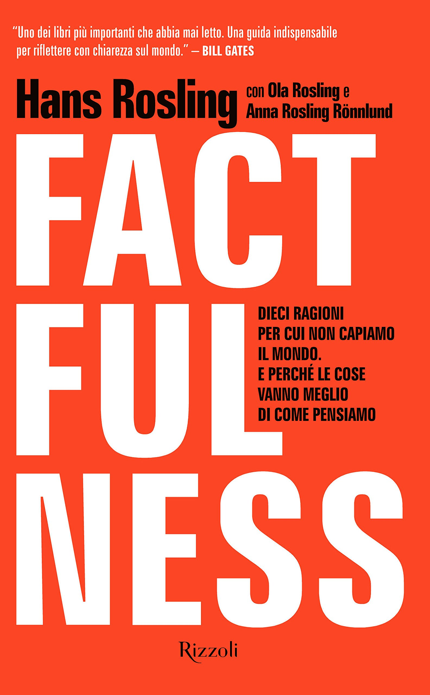
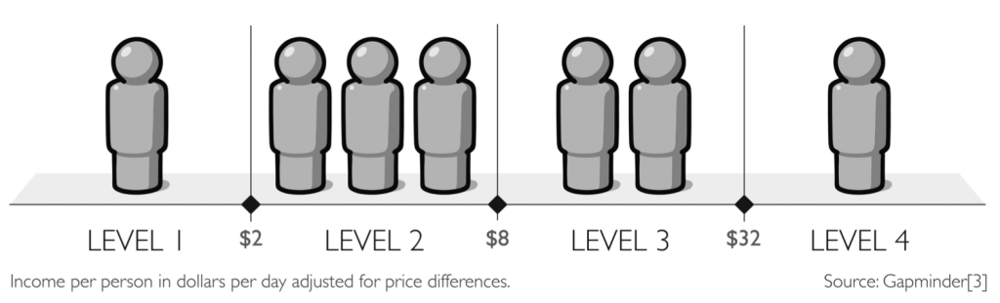
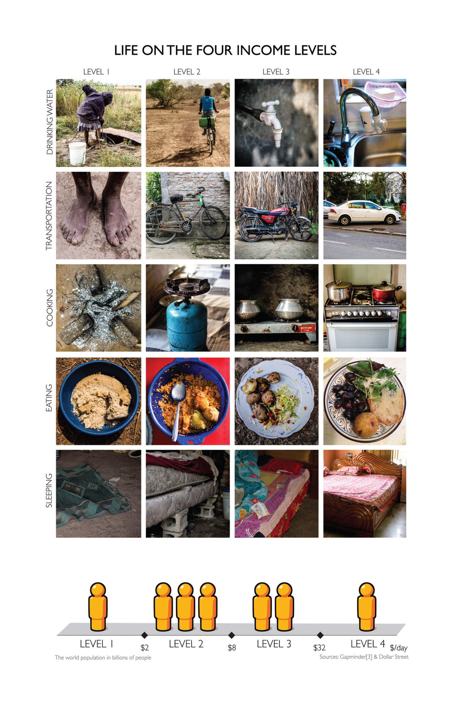
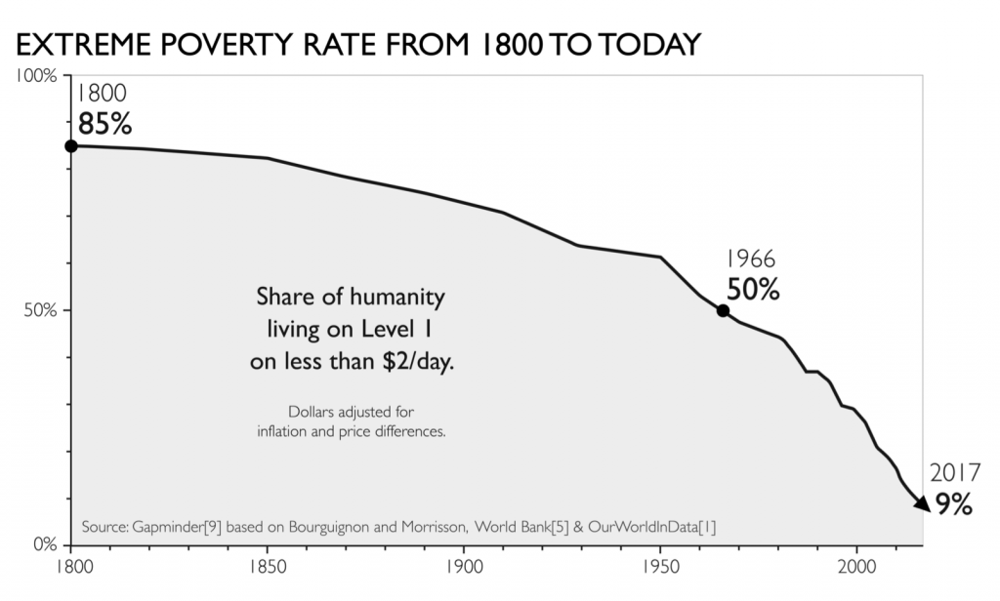
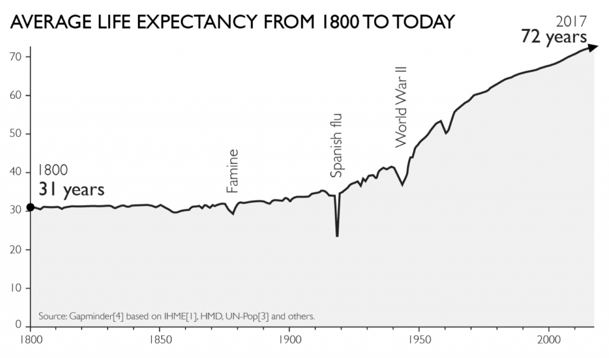
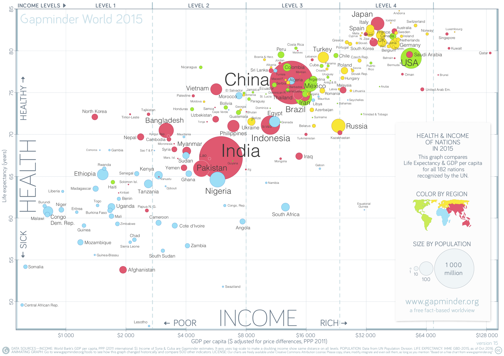
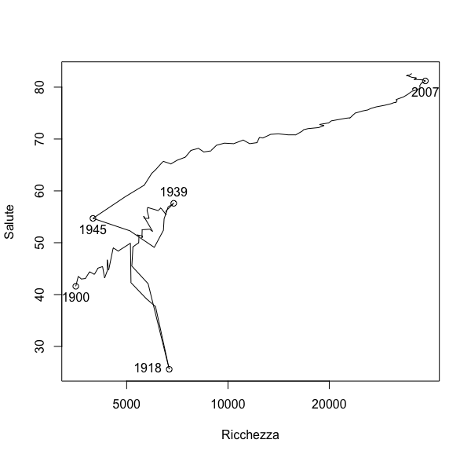
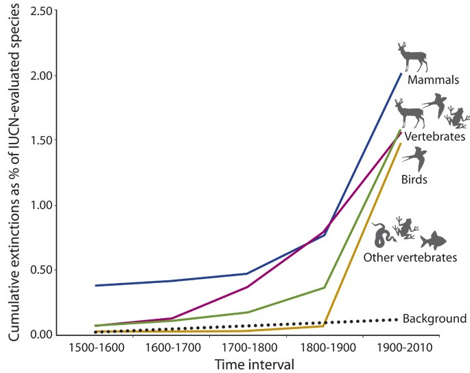
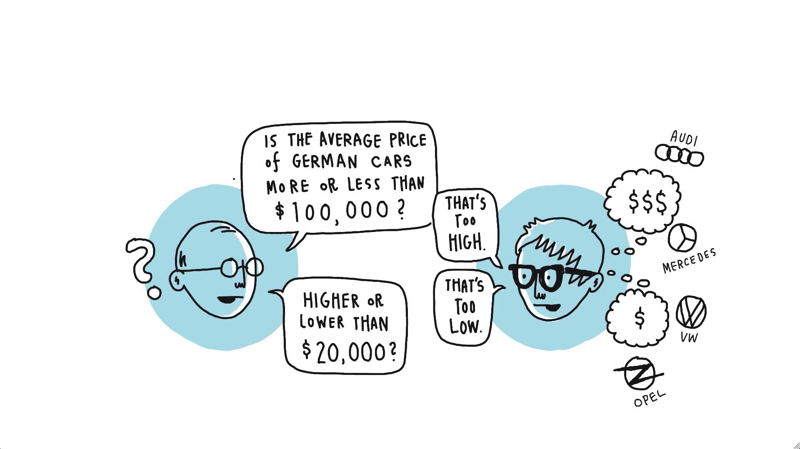

```{r startup, include = FALSE, message = FALSE, warning = FALSE}
knitr::opts_chunk$set(echo = F, 
                      eval=T, 
                      message=F, 
                      warning=F, 
                      error=F, 
                      comment=NA, 
                      cache=F)
```


class: center, middle

# Il laboratorio di Statistica di quest'anno

---

# L' ABC della statistica

### A) Cosa rilevare?

* Un fenomeno di interesse,
su cui vogliamo produrre nuove conoscenze o prendere delle decisioni

### B) Come raccogliere i dati?

* Strumenti di misurazione <br>
e.g. questionario, smartphone, social network, etc.

### C) Esplorazione, sintesi e presentazione dei risultati

* Interpretare i dati, evidenziando la “storia” che raccontano

---

# L' ABC della statistica

### A) Cosa rilevare?

1. La conoscenza degli aspetti socio-economici del mondo di oggi
    
2. L'effetto ancoraggio
    
### B) Come raccogliere i dati?

  *  Questionario *on-line* (realizzato con Google Forms)
  
### C) Esplorazione, sintesi e presentazione dei risultati

* In laboratorio questo pomeriggio

---

# Il questionario

1. La conoscenza degli aspetti socio-economici del mondo di oggi: <br> 10 domande ideate da **Hans Rosling**

    - Scolarizzazione delle bambine nei Paesi a basso reddito
    - Distribuzione del reddito globale
    - Povertà estrema
    - Durata della vita
    - Futuro numero di bambini
    - Animali in via d’estinzione
    - Catastrofi naturali
    - Dove vivono le persone
    - Vaccinazione dei bambini
    - Elettricità

2. L'effetto ancoraggio: <br> 3 domande ideate da **Daniel Kahneman** e **Amos Tversky**

    - Qual è il prezzo medio di un'automobile tedesca?
    - Quanti anni aveva Mahatma Gandhi quando morì? 
    - Qual è la % di Nazioni Africane rappresentate nelle Nazioni Unite?

---

class: center, middle

# La conoscenza degli aspetti socio-economici del mondo di oggi

---

# Hans Rosling

```{r, echo=FALSE, fig.align = 'center', out.width = '50%', out.height = '50%'}

```

Hans Rosling (1948 – 2017) è stato un medico, statistico e accademico svedese

---

```{r, echo=FALSE, fig.align = 'center', out.width = '40%', out.height = '40%'}

```


Nel suo libro **Factfulness**, sottotitolo: **Dieci ragioni per cui non capiamo il mondo e perché le cose vanno meglio** ci insegna, con il supporto dei fatti, ad avere una visione positiva del mondo di oggi

---

# Scolarizzazione delle bambine nei Paesi a basso reddito

Attualmente, nei Paesi a basso reddito di tutto il mondo, quante bambine finiscono la scuola primaria?

  $\Box$ A: 20 per cento 
    
  $\Box$ B: 40 per cento
    
  $\Box$ C: 60 per cento 
    
---

```{r}
library(ggplot2)
library(plotly)
library(dplyr)
library(readr)
load("dati.Rdata")
R1 <- dati %>%
      group_by(Q1) %>%
      summarise (n = n()) %>%
      mutate(perc = round(n *100/ sum(n),1))
p1 <- ggplot(data=R1, aes(x=Q1, y=perc, 
                          text=perc, 
                          fill=c("F","F","T"))) +
      geom_bar(stat="identity") +
      geom_hline(yintercept=33.33) +
      ylab("Percentuale") +
      xlab("Risposta") +
      guides(fill=FALSE) +
      theme_bw() +
      coord_flip() 
ggplotly(p1,
        tooltip="text")
```

* Solo il 7 per cento ha dato la risposta esatta

* La maggioranza (57%) ha ipotizzato che la cifra corretta fosse il 20 per cento

---

# Scolarizzazione delle bambine

```{r}
serie <- read_csv("scolar.csv", skip = 4)
serie=serie[,-c(1:4,64)]
time= c(1960:2018)
world=as.numeric(serie[258,])
low=as.numeric(serie[135,])
afghanistan=as.numeric(serie[2,])
plot_ly(x = time, y = world, mode = 'lines', name="Mondo", type="scatter") %>% 
  add_trace(y=low, name="Low income", mode="lines") %>%
  add_trace(y=afghanistan, name="Afghanistan", mode="lines") %>%
  layout(yaxis =list(title = "% di bambine che finiscono la scuola primaria"), xaxis=list(title="Anno"))
```

---

# Le fonti

* [UNESCO Institute for Statistics](https://data.worldbank.org/indicator/SE.PRM.CMPT.FE.ZS?locations=XM)

* Scolarizzazione delle bambine = indicatore SE.PRM.CMPT.FE.ZS (*Primary completion rate, female*)

* [Paesi a basso reddito](https://data.worldbank.org/indicator/SP.POP.TOTL?locations=XM-XP-XD) = 31 nel 2017, come definito dalla Banca Mondiale (*World Bank*) 

* Vedi anche https://www.gapminder.org/data/

---

# Distribuzione del reddito globale

Quali delle seguenti curve rappresenta la distribuzione del reddito globale oggi? 

```{r, echo=FALSE, fig.align = 'center', out.width = '40%', out.height = '40%'}
knitr::include_graphics("income.jpg")
```

---

```{r}
R2 <- dati %>%
      group_by(Q2) %>%
      summarise (n = n()) %>%
      mutate(perc = round(n *100/ sum(n),1))
p2 <- ggplot(data=R2, aes(x=Q2, y=perc, 
                          text=perc, 
                          fill=c("F","T","F"))) +
      geom_bar(stat="identity") +
      geom_hline(yintercept=33.33) +
      ylab("Percentuale") +
      xlab("Risposta") +
      guides(fill=FALSE) +
      theme_bw() +
      coord_flip() 
ggplotly(p2,
        tooltip="text")
```

* Il 31 per cento ha dato la risposta esatta

* La maggioranza (46%) ha ipotizzato che la distribuzione del reddito fosse bimodale 

---

# I quattro livelli di reddito

```{r, echo=FALSE, fig.align = 'center', out.width = '100%', out.height = '100%'}

```

* Ciascuna sagoma rappresenta un miliardo di persone

* Le 7 sagome mostrano come l'attuale popolazione mondiale sia spalmata su 4 livelli di reddito (espressi in dollari al giorno)

---

```{r, echo=FALSE, fig.align = 'center', out.width = '55%', out.height = '55%'}

```

---

# Povertà estrema

Negli ultimi 20 anni, la percentuale della popolazione mondiale che vive in condizioni di estrema povertà è più o meno...

  $\Box$ A: Raddoppiata 
    
  $\Box$ B: Rimasta la stessa 
    
  $\Box$ C: Dimezzata
    
---

```{r}
R3 <- dati %>%
      group_by(Q3) %>%
      summarise (n = n()) %>%
      mutate(perc = round(n *100/ sum(n),1))
p3 <- ggplot(data=R3, aes(x=Q3, y=perc, 
                          text=perc, 
                          fill=c("T","F","F"))) +
      geom_bar(stat="identity") +
      geom_hline(yintercept=33.33) +
      ylab("Percentuale") +
      xlab("Risposta") +
      guides(fill=FALSE) +
      theme_bw() +
      coord_flip() 
ggplotly(p3,
        tooltip="text")
```

* Solo il 13 per cento ha dato la risposta esatta

* La maggioranza (52%) ha ipotizzato che fosse raddoppiata

---

```{r, echo=FALSE, fig.align = 'center', out.width = '120%', out.height = '120%'}

```

* Vent'anni fa, circa il 30 per cento della popolazione mondiale viveva in povertà estrema (meno di 1,9 dollari al giorno)

* Oggi questo numero è pari a circa il 10 per cento (800 milioni di persone)

---

# La povertà estrema dal 1800 a oggi

https://www.gapminder.org/fw/income-mountains/

---

# Durata della vita

Qual è l'attuale aspettativa di vita a livello mondiale? 

  $\Box$ A: 50 anni 
    
  $\Box$ B: 60 anni 
    
  $\Box$ C: 70 anni

---

```{r}
R4 <- dati %>%
      group_by(Q4) %>%
      summarise (n = n()) %>%
      mutate(perc = round(n *100/ sum(n),1))
p4 <- ggplot(data=R4, aes(x=Q4, y=perc, 
                          text=perc, 
                          fill=c("F","F","T"))) +
      geom_bar(stat="identity") +
      geom_hline(yintercept=33.33) +
      ylab("Percentuale") +
      xlab("Risposta") +
      guides(fill=FALSE) +
      theme_bw() +
      coord_flip() 
ggplotly(p4,
        tooltip="text")
```

* Il 41 per cento ha dato la risposta esatta

* La maggioranza (49%) ha ipotizzato 60 anni. Sarebbe stata corretta se avessimo fatto la domanda nel 1973

---

```{r, echo=FALSE, fig.align = 'center', out.width = '120%', out.height = '120%'}

```

---

class: center, middle

# La mappa della salute e ricchezza mondiale

---

```{r, echo=FALSE, fig.align = 'center', out.width = '100%', out.height = '100%'}

```

* Salute =  aspettativa di vita alla nascita (in anni)

* Ricchezza = reddito pro capite (in dollari per anno adeguati all'inflazione)

---

# Salute e ricchezza dal 1800 ad oggi

https://www.gapminder.org/tools/

---

# L'Italia

```{r, echo=FALSE, fig.align = 'center', out.width = '70%', out.height = '70%'}

```

---

# Un italiano

```{r, echo=FALSE, fig.align = 'center', out.width = '30%', out.height = '30%'}

```


> Ragionamenti di tipo probabilistico e statistico sono uno strumento della ragione, potente e affilato. <br> 
Non disporne ci lascia indifesi. <br> 
Non avere chiarezza su nozioni come media, varianza, fluttuazioni e correlazioni è un pò come non sapere usare la moltiplicazione o la divisione.

Carlo Rovelli, 20 Gennaio 2013 Domenica Il Sole 24 Ore
  
---

# Critiche a Factfulness

* [The One-Sided Worldview of Hans Rosling](https://quillette.com/2018/11/16/the-one-sided-worldview-of-hans-rosling/)

* ["Factfulness": a more accurate title for this new book would have been "Selecting Facts to Make You Happy"](https://overpopulation-project.com/2018/08/28/factfulness-a-more-accurate-title-for-this-new-book-would-have-been-selecting-facts-to-make-you-happy/)

* [Can the book “Factfulness” be improved?](https://overpopulation-project.com/2018/10/04/can-the-book-factfulness-be-improved/)

---

# Animali in via d'estinzione

```{r, echo=FALSE, fig.align = 'center', out.width = '75%', out.height = '75%'}

```

---

# La deforestazione tropicale

Nel 2003 la quantità di deforestazione tropicale è stata di 6,5 milioni di ettari. Nel 2017 ... 

  $\Box$ A: Si è dimezzata a 3,25 milioni di ettari
  
  $\Box$ B: E' rimasta più o meno la stessa (6,5 milioni di ettari)
  
  $\Box$ C: E' aumentata di oltre 2,5 volte (15,8 milioni di ettari)

---

# I più ricchi

Le 42 persone più ricche del mondo hanno la stessa ricchezza di quanti tra i più poveri?

  $\Box$ A: 1 milione 
    
  $\Box$ B: 1 miliardo
    
  $\Box$ C: 3.7 miliardi (metà della popolazione mondiale)

---

class: center, middle

# L'effetto ancoraggio

---

# Daniel Kahneman e Amos Tversky

Circa quarant'anni or sono gli psicologi israeliani Daniel Kahneman e Amos Tversky hanno dato alle stampe una serie di lavori in cui
mostravano come la mente umana tenda a cadere in errore quando si
trova costretta a scegliere in situazioni di incertezza

---

Le loro scoperte hanno posto le basi di una nuova disciplina, l’economia
comportamentale, e la loro teoria della mente è stata premiata con il
Nobel vinto da Kahneman nel 2002

---

```{r, echo=FALSE, fig.align = 'center', out.width = '100%', out.height = '100%'}

```

---

# Prezzo medio automobile tedesca


---

# Mahatma Gandhi

2 Ottobre 1869 - 30 Gennaio 1948 (78 anni)
